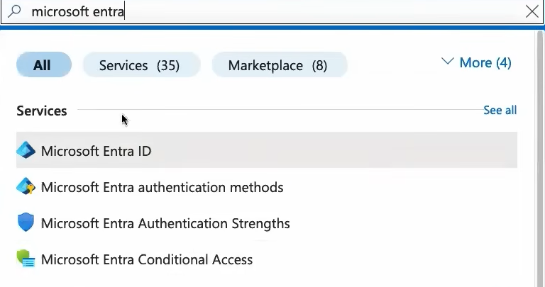
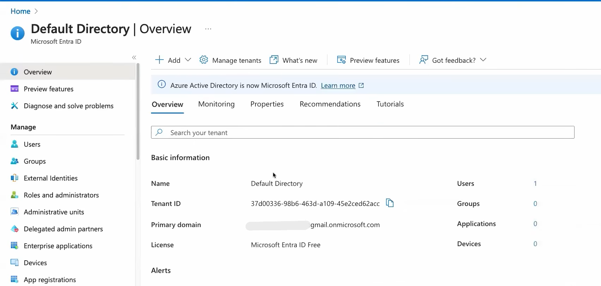

# Azure Identity and Access

Microsoft Entra ID and Azure Role-Based Access Control (RBAC) are used to manage identities, authentication, authorization, users, groups, and access to Azure resources.

---

## 1. Microsoft Entra ID

Microsoft Entra ID is Microsoft's cloud-based identity and access management service.

It helps organizations manage:

- Users
- Groups
- Applications
- Devices
- Access to resources
- Authentication
- Authorization

### Practical: Open Microsoft Entra ID

1. Sign in to the [Azure Portal](https://portal.azure.com/).

2. Search for **Microsoft Entra ID**.

3. Open **Microsoft Entra ID**.

4. On the Overview page, verify the following information:

   - Tenant name
   - Tenant ID
   - Primary domain
---
## Screenshot

### Search for **Microsoft Entra ID**.

---

###  Microsoft Entra ID **Overview**

---
The Tenant ID can also be viewed from:

**Microsoft Entra ID → Properties → Tenant ID**

---

# 2. Users

Users are identities that can sign in to Microsoft cloud services and access resources according to the permissions assigned to them.

## Practical: Create a User

1. Open **Microsoft Entra ID**.

2. Select **Users** from the left-side menu.

3. Select **New user**.

4. Select **Create new user**.

5. Enter the username.

   Example:

   `clouduser01`

6. Select the appropriate domain.

7. Enter the user's display name.

8. Set the password option.

9. Review the user details.

10. Select **Review + create**.

11. Select **Create**.

### Screenshot

Add a screenshot of the user creation page here.

### Verify User

1. Go to **Microsoft Entra ID → Users**.

2. Search for `clouduser01`.

3. Open the user.

4. Verify the user's:

   - Display name
   - User principal name
   - Object ID
   - Account status

---

# 3. Groups

Groups are used to organize users and simplify access management.

Instead of assigning permissions individually to every user, users can be placed into groups and permissions can be assigned according to the organization's requirements.

## Practical: Create a Group

1. Open **Microsoft Entra ID**.

2. Select **Groups**.

3. Select **New group**.

4. Select:

   **Group type:** Security

5. Enter the group name.

   Example:

   `Azure-Cloud-Users`

6. Add a description.

   Example:

   `Group for Azure cloud users`

7. Select **No** for Microsoft Entra roles can be assigned to the group unless role assignment to the group is specifically required.

8. Select **Create**.

### Screenshot

---

## Add User to Group

1. Open **Microsoft Entra ID**.

2. Select **Groups**.

3. Open:

   `Azure-Cloud-Users`

4. Select **Members**.

5. Select **Add members**.

6. Search for:

   `clouduser01`

7. Select the user.

8. Select **Select**.

---

# 4. Roles and Permissions

A role defines what actions a user or group can perform.

Examples of Azure roles include:

- Owner
- Contributor
- Reader
- Virtual Machine Contributor
- Storage Blob Data Contributor

Permissions should be assigned according to the principle of least privilege.

For example:

- Reader → Can view resources
- Contributor → Can manage resources but cannot manage access
- Owner → Can manage resources and access

---

# 5. Azure RBAC

Azure Role-Based Access Control (RBAC) is used to control who can access Azure resources and what they can do with those resources.

Azure RBAC assignments consist of:

**Security principal + Role + Scope**

### Security Principal

The identity receiving access.

Examples:

- User
- Group
- Service principal
- Managed identity

### Role

Defines what actions the identity can perform.

Examples:

- Reader
- Contributor
- Owner

### Scope

Defines where the permission applies.

Azure supports scopes at:

- Management group
- Subscription
- Resource group
- Resource

---

# Practical: Create a Resource Group

Before demonstrating Azure RBAC, create a resource group.

1. Search for **Resource groups** in the Azure Portal.

2. Select **Create**.

3. Select your Azure subscription.

4. Enter a resource group name.

   Example:

   `rg-rbac-lab`

5. Select an appropriate region.

6. Select **Review + create**.

7. Select **Create**.

### Screenshot

---

# Practical: Assign Reader Role

We will assign the **Reader** role to the user created earlier.

1. Open:

   **Resource groups**

2. Open:

   `rg-rbac-lab`

3. Select **Access control (IAM)**.

4. Select **Add**.

5. Select **Add role assignment**.

6. In the Role tab, search for:

   `Reader`

7. Select **Reader**.

8. Select **Next**.

9. Under Members, select:

   **User, group, or service principal**

10. Select **Select members**.

11. Search for:

   `clouduser01`

12. Select the user.

13. Select **Select**.

14. Select **Next**.

15. Review the configuration.

16. Select **Review + assign**.

17. Select **Review + assign** again.

### Screenshot

---

# Verify Azure RBAC Assignment

1. Open the resource group:

   `rg-rbac-lab`

2. Select **Access control (IAM)**.

3. Select **Role assignments**.

4. Search for:

   `clouduser01`

5. Verify that the user has the **Reader** role.

### Screenshot

---

# Practical: Assign Contributor Role

Now we can demonstrate a higher level of access.

1. Open:

   **Resource groups → rg-rbac-lab**

2. Select **Access control (IAM)**.

3. Select **Add → Add role assignment**.

4. Search for:

   `Contributor`

5. Select **Contributor**.

6. Select **Next**.

7. Select **User, group, or service principal**.

8. Select **clouduser01**.

9. Select **Review + assign**.

### Screenshot

### Difference

**Reader**

Can view resources but cannot make changes.

**Contributor**

Can create and manage Azure resources but cannot assign Azure RBAC roles.

**Owner**

Has full access to resources, including the ability to manage access.

---

# 6. Managed Identities

Managed identities allow Azure resources to authenticate to other Azure services without storing passwords, secrets, or credentials in application code.

There are two main types:

- System-assigned managed identity
- User-assigned managed identity

## Practical: Enable System-Assigned Managed Identity

This can be demonstrated using an Azure Virtual Machine.

1. Open an Azure Virtual Machine.

2. Select **Identity**.

3. Under System assigned, select:

   **On**

4. Select **Save**.

5. Azure creates an identity associated with the VM.

### Screenshot

Managed identities are useful when an Azure resource needs to access another Azure service securely.

---

# 7. Service Principals

A service principal is an identity used by an application, service, or automation process to access Azure resources.

For example, a CI/CD pipeline can use a service principal to authenticate to Azure and deploy resources.

### Basic Concept

Application

↓

Service Principal

↓

Microsoft Entra ID

↓

Azure Resource

Service principals are commonly used for automation and application authentication.

---

# 8. Authentication and Authorization

Authentication and authorization are different concepts.

## Authentication

Authentication answers:

**"Who are you?"**

Example:

A user signs in using their Microsoft account and password.

Microsoft Entra ID verifies the user's identity.

## Authorization

Authorization answers:

**"What are you allowed to do?"**

After authentication, Azure checks the user's roles and permissions.

### Example

`clouduser01` successfully signs in.

Authentication:

**User identity verified**

Authorization:

**Reader role → Can view the resource**

The user cannot modify the resource because they don't have a role that allows modification.

---

# Authentication vs Authorization

| Feature | Authentication | Authorization |
|---|---|---|
| Meaning | Verifies identity | Determines permissions |
| Question | Who are you? | What can you do? |
| Example | Username and password | Reader/Contributor role |
| Managed by | Microsoft Entra ID | Azure RBAC and permissions |

---

