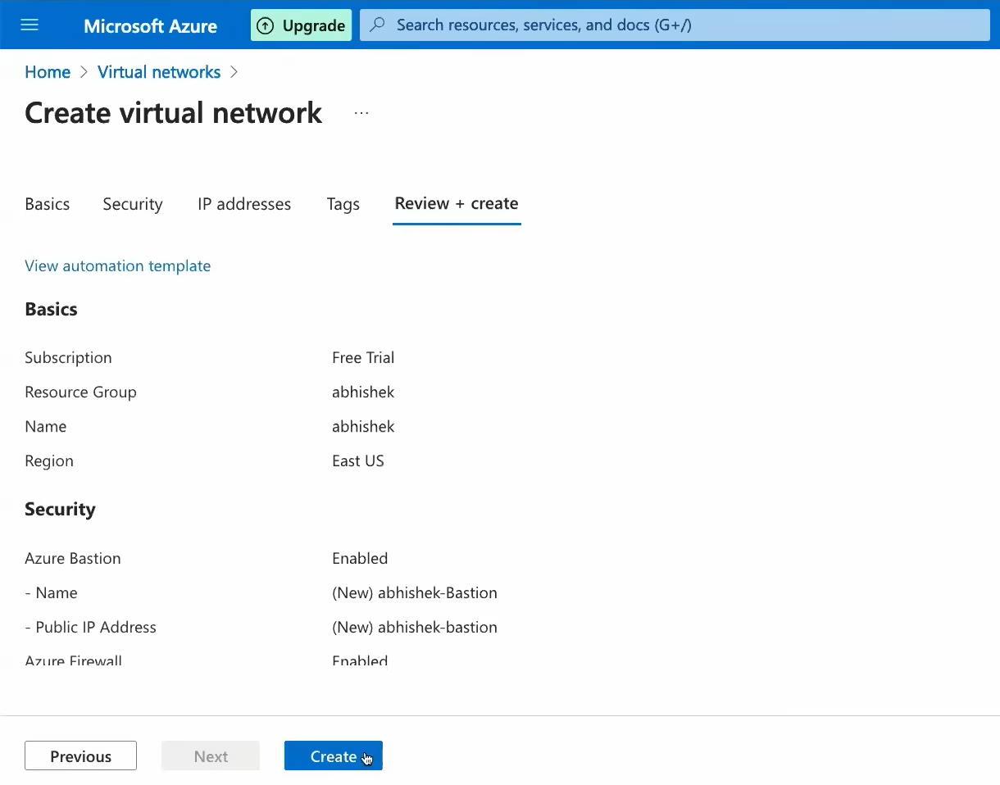
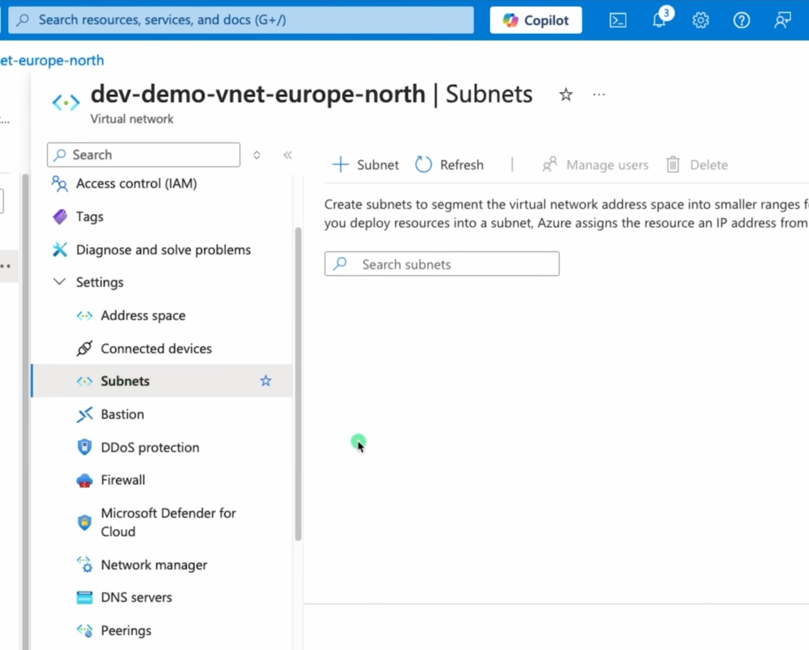
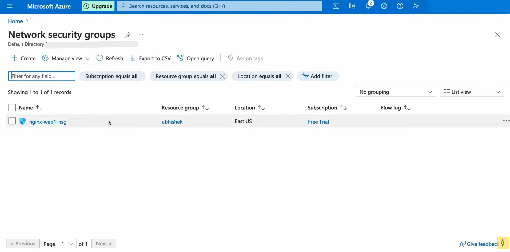
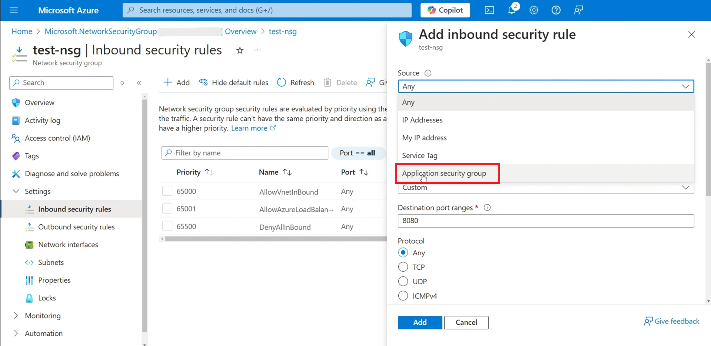
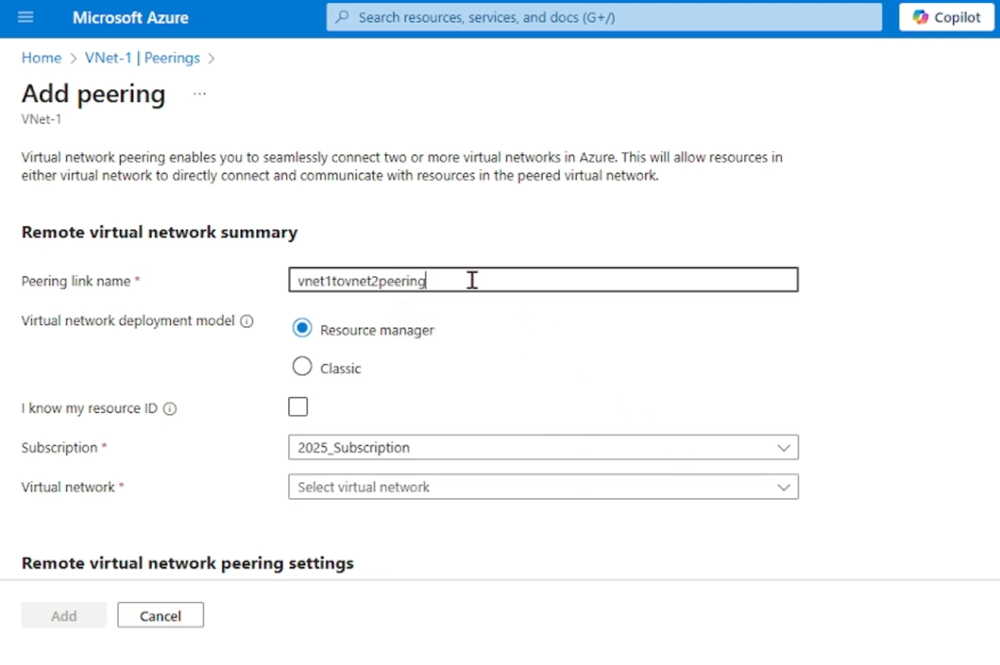
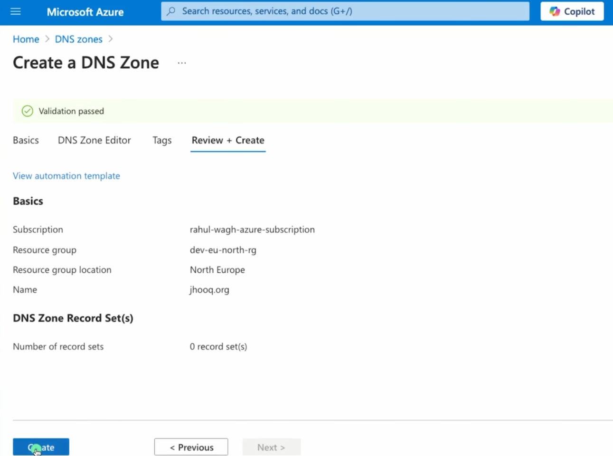
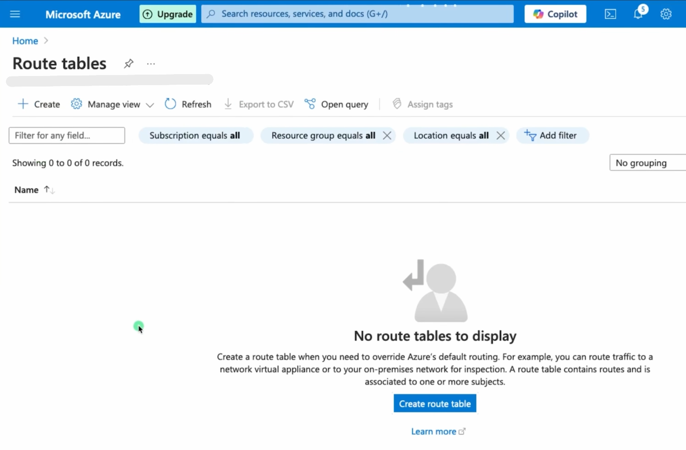
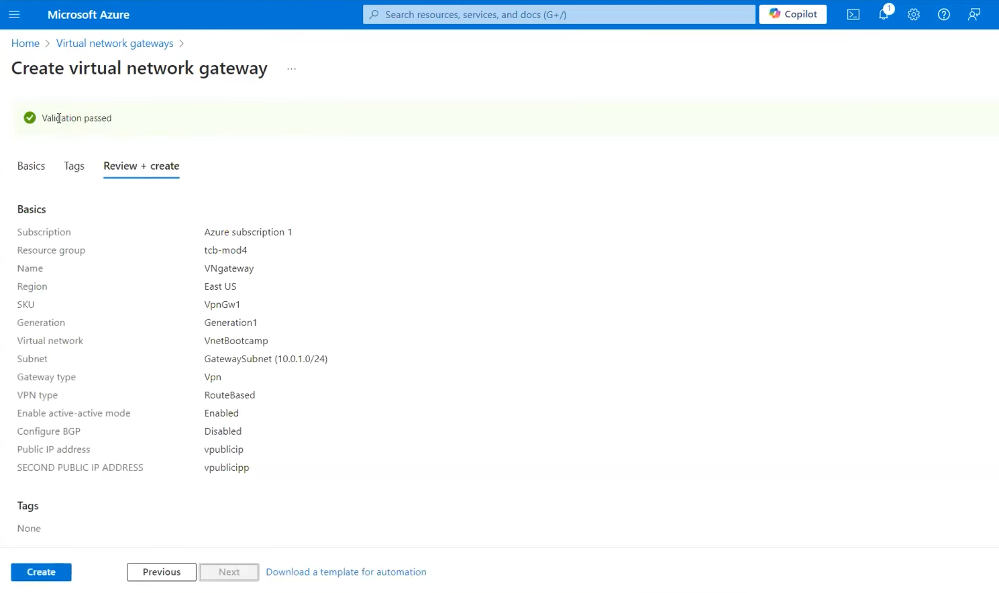

# 8. Azure Networking

## Overview

Azure Networking provides the network infrastructure required to securely connect Azure resources with each other, the internet, on-premises networks, and other Azure virtual networks.

Azure networking includes Virtual Networks, subnets, IP addresses, Network Security Groups, Application Security Groups, VNet Peering, Azure DNS, Route Tables, User Defined Routes, VPN Gateway, and ExpressRoute.

---

## Virtual Network (VNet)

### Explanation

Azure Virtual Network (VNet) is a logically isolated network in Azure. It allows Azure resources such as Virtual Machines, Azure App Services, and other services to communicate securely with each other and with external networks.

A VNet contains one or more subnets and uses IP address ranges defined using CIDR notation.

### Steps to Create a Virtual Network

1. Sign in to the Azure Portal.
2. Search for **Virtual Networks**.
3. Select **Create**.
4. Select the required **Subscription**.
5. Select or create a **Resource Group**.
6. Enter the **Virtual Network name**.
7. Select the required **Region**.
8. Configure the **IPv4 address space**.
9. Create a **Subnet**.
10. Review the configuration.
11. Select **Review + create**.
12. Select **Create**.

### Screenshot

---

## Subnets

### Explanation

A subnet is a smaller network segment inside an Azure Virtual Network. Subnets are used to organize and isolate resources within a VNet.

For example, a VNet can contain separate subnets for web servers, application servers, and database servers.

### Steps to Create a Subnet

1. Open **Virtual Networks** in the Azure Portal.
2. Select the required **Virtual Network**.
3. Select **Subnets**.
4. Select **+ Subnet**.
5. Enter the **Subnet name**.
6. Enter the required **Subnet address range**.
7. Configure any required subnet settings.
8. Select **Save**.

### Screenshot

---

## Public and Private IP Addresses

### Explanation

Azure resources can use public and private IP addresses.

A **private IP address** is used for communication within a VNet or connected networks.

A **public IP address** allows a resource to communicate with the internet when the resource and its configuration permit it.

Private IP addresses are commonly used for internal communication, while public IP addresses can be used for services that need internet connectivity.

### Steps to Configure an IP Address

1. Open the required Azure resource.
2. Open its **Networking** settings.
3. Select the required **Network Interface**.
4. Open **IP configurations**.
5. Review the private IP configuration.
6. Configure a public IP address if required.
7. Save the configuration.

---

##  Network Security Group (NSG)

### Explanation

A Network Security Group (NSG) controls inbound and outbound network traffic.

NSG rules can allow or deny traffic based on parameters such as source, destination, port, and protocol.

For example, an NSG rule can allow HTTP traffic on port 80 or HTTPS traffic on port 443.

### Steps to Create an NSG

1. Sign in to the Azure Portal.
2. Search for **Network Security Groups**.
3. Select **Create**.
4. Select the required **Subscription**.
5. Select the required **Resource Group**.
6. Enter the **NSG name**.
7. Select the required **Region**.
8. Select **Review + create**.
9. Select **Create**.
10. Open the created NSG.
11. Select **Inbound security rules** or **Outbound security rules**.
12. Add the required security rule.
13. Configure the protocol, port, source, destination, and action.
14. Save the rule.

### Screenshot

---

## Application Security Group (ASG)

### Explanation

An Application Security Group (ASG) allows network security rules to be grouped according to application workloads.

For example, web servers can be placed in one ASG and application servers in another ASG. NSG rules can then use these ASGs as sources or destinations.

### Steps to Create an ASG

1. Search for **Application Security Groups**.
2. Select **Create**.
3. Select the required **Subscription**.
4. Select the required **Resource Group**.
5. Enter the **ASG name**.
6. Select the required **Region**.
7. Select **Review + create**.
8. Select **Create**.
9. Associate the required network interfaces with the ASG.
10. Use the ASG in an NSG security rule if required.

### Screenshot

---

## VNet Peering

### Explanation

VNet Peering connects two Azure Virtual Networks so that resources in the VNets can communicate using private IP addresses.

VNet peering can be used to connect networks in the same Azure region or across different Azure regions.

### Steps to Configure VNet Peering

1. Open **Virtual Networks**.
2. Select the first VNet.
3. Select **Peerings**.
4. Select **+ Add**.
5. Enter the peering name.
6. Select the second VNet.
7. Configure the required peering options.
8. Review the configuration.
9. Select **Add**.

### Screenshot

---

## Azure DNS

### Explanation

Azure DNS is a DNS hosting service that allows domain name resolution using Azure infrastructure.

It can host DNS zones and DNS records such as A, AAAA, CNAME, MX, and TXT records.

### Steps to Configure Azure DNS

1. Sign in to the Azure Portal.
2. Search for **DNS zones**.
3. Select **Create**.
4. Select the required **Subscription**.
5. Select the required **Resource Group**.
6. Enter the **DNS zone name**.
7. Select **Review + create**.
8. Select **Create**.
9. Open the DNS zone.
10. Add the required DNS records.

### Screenshot

---

## Route Tables

### Explanation

An Azure Route Table contains routes that determine where network traffic should be sent.

Azure automatically creates system routes, but custom routes can also be created when specific traffic forwarding is required.

### Steps to Create a Route Table

1. Search for **Route tables** in the Azure Portal.
2. Select **Create**.
3. Select the required **Subscription**.
4. Select the required **Resource Group**.
5. Enter the **Route table name**.
6. Select the required **Region**.
7. Select **Review + create**.
8. Select **Create**.
9. Open the route table.
10. Add the required route.
11. Associate the route table with the required subnet.

### Screenshot

---

## User Defined Routes (UDR)

### Explanation

User Defined Routes (UDR) are custom routes created by an administrator to control how network traffic is routed.

UDRs can be used to send traffic through a network virtual appliance, firewall, VPN Gateway, or another network path.

### Steps to Configure a UDR

1. Open **Route tables**.
2. Select the required route table.
3. Select **Routes**.
4. Select **+ Add**.
5. Enter the **Route name**.
6. Enter the **Destination**.
7. Select the required **Next hop type**.
8. Enter the next-hop address if required.
9. Select **Add**.
10. Associate the route table with the required subnet.

### Screenshot

---

## VPN Gateway

### Explanation

Azure VPN Gateway provides encrypted connectivity between Azure Virtual Networks and on-premises networks through a VPN connection.

It can be used for site-to-site VPN, point-to-site VPN, and VNet-to-VNet connectivity.

### Steps to Create a VPN Gateway

1. Sign in to the Azure Portal.
2. Search for **Virtual network gateways**.
3. Select **Create**.
4. Select the required **Subscription**.
5. Select the required **Resource Group**.
6. Enter the **Gateway name**.
7. Select **VPN** as the gateway type.
8. Select the required **Virtual Network**.
9. Configure the required **Public IP address**.
10. Select the required SKU.
11. Review the configuration.
12. Select **Review + create**.
13. Select **Create**.

### Screenshot

---

## ExpressRoute

### Explanation

Azure ExpressRoute provides a private connection between an on-premises network and Microsoft cloud services.

Unlike a normal internet-based VPN connection, ExpressRoute uses connectivity provided through an ExpressRoute service provider or ExpressRoute Direct.

It is commonly used by organizations that require reliable, private, and high-performance connectivity to Azure.

### Steps to Configure ExpressRoute

1. Sign in to the Azure Portal.
2. Search for **ExpressRoute circuits**.
3. Select **Create**.
4. Select the required **Subscription**.
5. Select the required **Resource Group**.
6. Enter the **ExpressRoute circuit name**.
7. Select the required **Region**.
8. Select the required connectivity provider.
9. Configure the required bandwidth.
10. Configure the required SKU.
11. Review the configuration.
12. Select **Review + create**.
13. Select **Create**.

