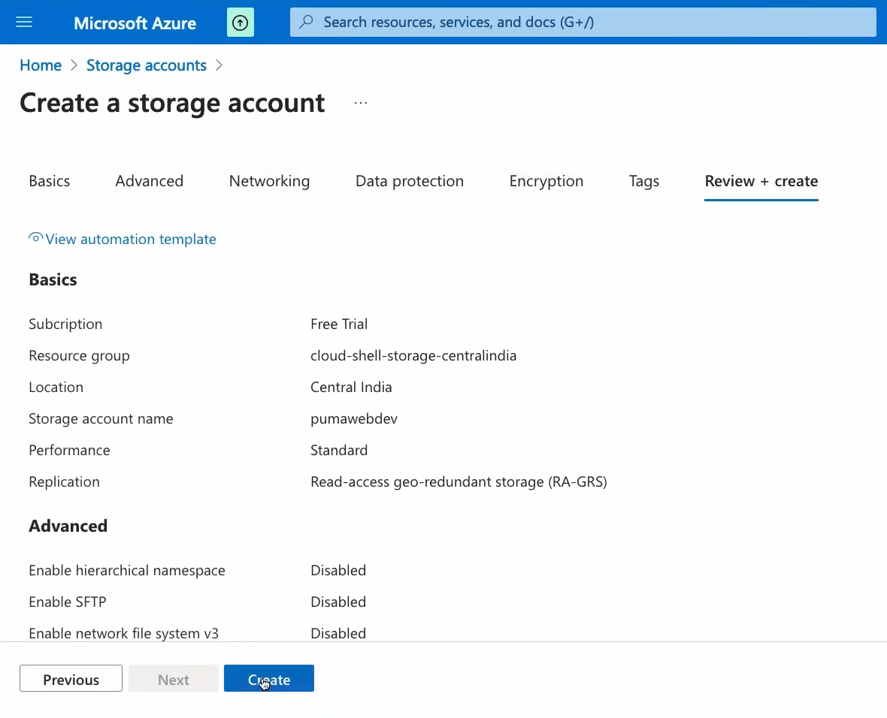
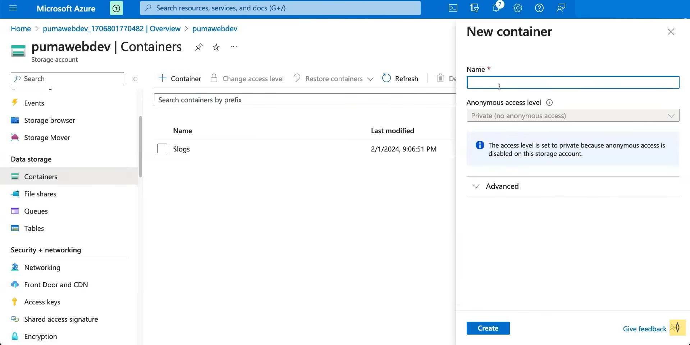
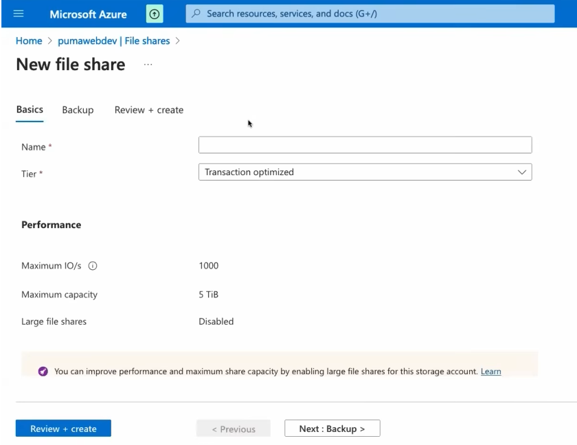
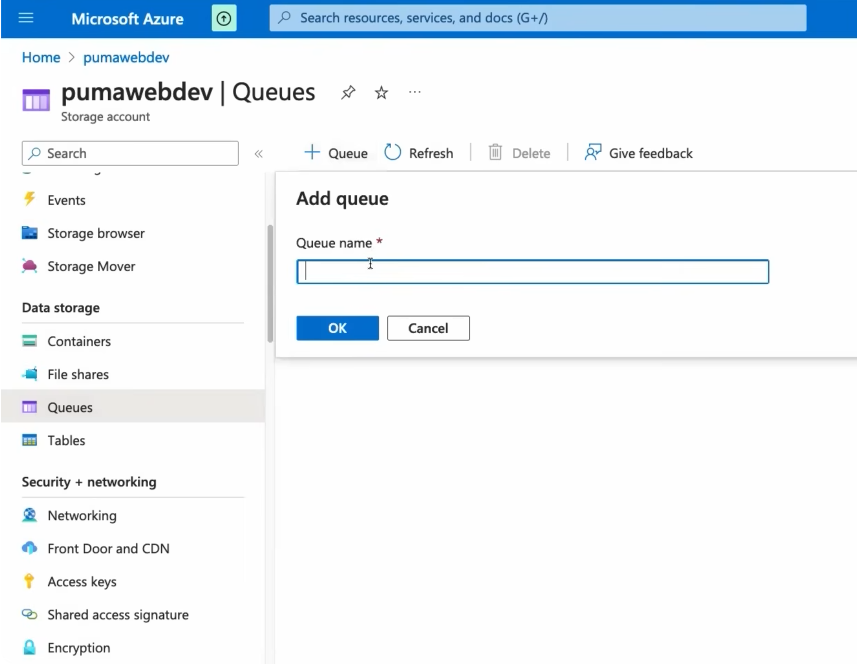
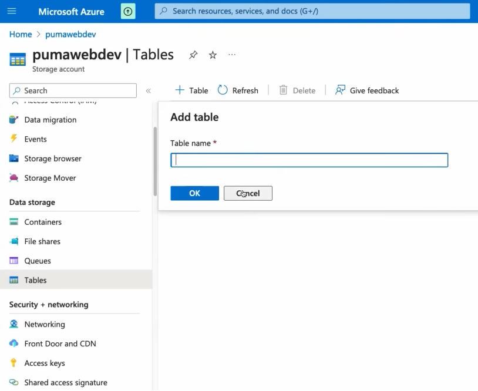
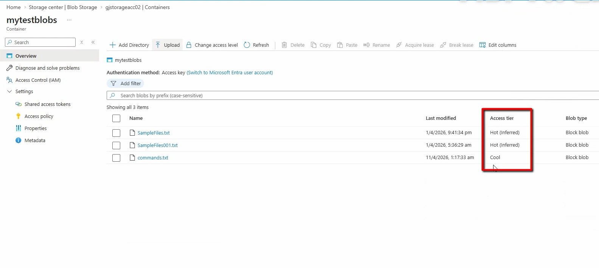
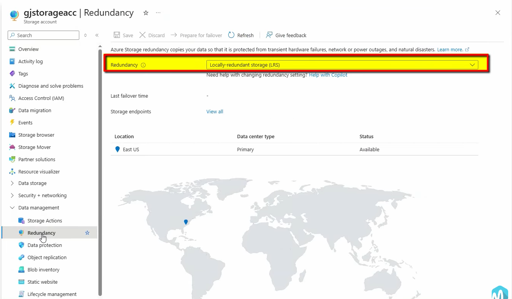
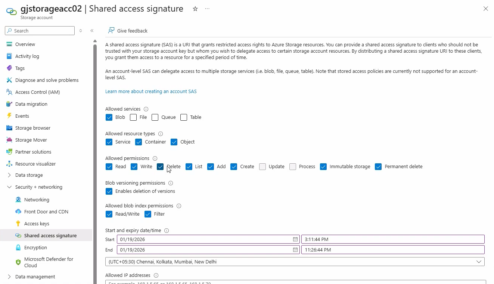
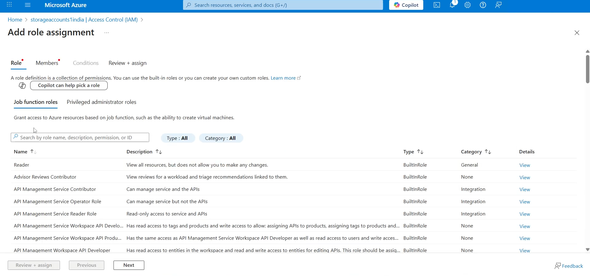

# Azure Storage

## Storage Accounts

### Explanation

An Azure Storage account provides a secure and scalable storage namespace for Azure Storage services. It can be used to store blobs, files, queues, and tables. :contentReference[oaicite:0]{index=0}

### Steps to Create a Storage Account

1. Sign in to the Azure Portal.
2. Search for **Storage accounts**.
3. Select **Create**.
4. Select the required **Subscription**.
5. Select or create a **Resource Group**.
6. Enter a unique **Storage account name**.
7. Select the required **Region**.
8. Select the required **Performance**.
9. Select the required **Redundancy** option.
10. Review the configuration.
11. Select **Review + create**.
12. Select **Create**.

### Screenshot

---

## Blob Storage

### Explanation

Azure Blob Storage is designed for storing large amounts of unstructured data such as images, videos, documents, backups, and log files.

Blob data is organized into containers, and containers are stored inside a storage account. 

### Steps to Create Blob Storage

1. Open the required **Storage account**.
2. Select **Data storage**.
3. Select **Containers**.
4. Select **+ Container**.
5. Enter the **Container name**.
6. Select the required **Public access level**.
7. Select **Create**.
8. Open the created container.
9. Select **Upload**.
10. Select the required file.
11. Select **Upload**.

### Screenshot

---

## Azure Files

### Explanation

Azure Files provides managed cloud file shares that can be accessed using standard file-sharing protocols. It is useful when multiple systems or applications need access to shared files.

### Steps to Create Azure Files

1. Open the required **Storage account**.
2. Select **Data storage**.
3. Select **File shares**.
4. Select **+ File share**.
5. Enter the **File share name**.
6. Select the required **Access tier**.
7. Configure the required **Quota**.
8. Select **Create**.
9. Open the created file share.
10. Select **Upload** to add files.

### Screenshot

---

## Queue Storage

### Explanation

Azure Queue Storage provides a messaging system for storing large numbers of messages. Applications can use queues to temporarily store messages and process them asynchronously.

### Steps to Create Queue Storage

1. Open the required **Storage account**.
2. Select **Data storage**.
3. Select **Queues**.
4. Select **+ Queue**.
5. Enter the **Queue name**.
6. Select **Create**.
7. Open the created queue.
8. Add messages when required.

### Screenshot

---

## Table Storage

### Explanation

Azure Table Storage is a NoSQL data store used for storing structured, non-relational data.

Data is stored as entities inside tables. Each entity contains properties that represent the stored data.

### Steps to Create Table Storage

1. Open the required **Storage account**.
2. Select **Data storage**.
3. Select **Tables**.
4. Select **+ Table**.
5. Enter the **Table name**.
6. Select **Create**.
7. Open the created table.
8. Add entities when required.
9. Enter the required partition key and row key.
10. Add the required properties.
11. Save the entity.

### Screenshot

---

## Storage Tiers

### Explanation

Storage tiers determine how frequently blob data is expected to be accessed and help optimize storage costs.

For Blob Storage, common access tiers include **Hot**, **Cool**, and **Cold**, with **Archive** available for long-term offline storage scenarios.

Hot is intended for frequently accessed data, while cooler tiers are intended for data accessed less frequently.

### Steps to Configure a Storage Tier

1. Open the required **Storage account**.
2. Open **Containers**.
3. Open the required container.
4. Select the required blob.
5. Select **Change tier**.
6. Select the required access tier.
7. Confirm the change.

### Screenshot

---

## Redundancy Options

### Explanation

Azure Storage redundancy maintains multiple copies of data to protect against hardware failures and, depending on the selected option, failures affecting availability zones or regions.

Common options include **LRS**, **ZRS**, **GRS**, and **GZRS**. The appropriate option depends on availability, durability, geographic protection, and cost requirements. 

### Steps to Configure Redundancy

1. Open the required **Storage account**.
2. Select **Configuration**.
3. Locate the **Replication** or redundancy setting.
4. Select the required redundancy option.
5. Review the configuration.
6. Save the changes if applicable.

### Screenshot

---

## SAS Tokens

### Explanation

A Shared Access Signature (SAS) provides delegated and time-limited access to Azure Storage resources. A SAS can specify which resources can be accessed, what permissions are allowed, and how long the access remains valid. :contentReference[oaicite:3]{index=3}

For applications that need SAS, Microsoft recommends using a user delegation SAS where possible rather than relying on account keys. 
### Steps to Generate a SAS Token

1. Open the required **Storage account**.
2. Open the required storage service or resource.
3. Select the appropriate **Shared access signature** option.
4. Select the required permissions.
5. Configure the **Start** and **Expiry** times.
6. Select the required allowed protocols.
7. Select the required IP restrictions if applicable.
8. Select **Generate SAS and connection string**.
9. Copy the generated SAS information securely.

### Screenshot

---

## Storage Security

### Explanation

Azure Storage security controls who can access storage resources and what operations they can perform.

Azure Storage supports Microsoft Entra ID with Azure RBAC, SAS, and Shared Key authorization. Microsoft recommends Microsoft Entra ID with managed identities where possible because it avoids storing sensitive account keys in applications. 

### Steps to Configure Storage Security

1. Open the required **Storage account**.
2. Open **Access control (IAM)**.
3. Select **Add**.
4. Select **Add role assignment**.
5. Select the required Azure RBAC role.
6. Select the required user, group, service principal, or managed identity.
7. Review the role assignment.
8. Select **Review + assign**.
9. Open **Configuration** and review storage security settings.
10. Configure additional security options according to the requirement.

### Screenshot

---

## Summary

Azure Storage provides scalable cloud storage for different types of data and application requirements.

- **Storage Accounts** provide the main storage namespace.
- **Blob Storage** stores unstructured object data.
- **Azure Files** provides managed file shares.
- **Queue Storage** provides asynchronous message storage.
- **Table Storage** provides NoSQL structured data storage.
- **Storage Tiers** help optimize storage costs according to access frequency.
- **Redundancy Options** protect data against failures.
- **SAS Tokens** provide controlled and time-limited access to storage resources.
- **Storage Security** controls authentication, authorization, and access to storage data.
